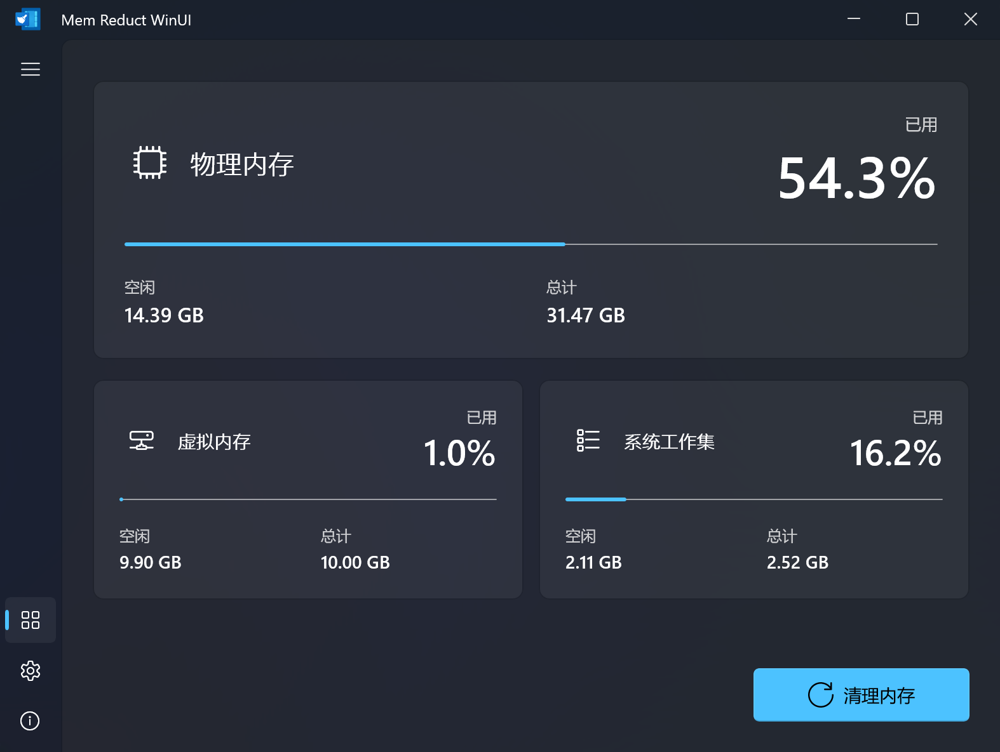

<p align="center">
  
</p>

<h1 align="center">Mem Reduct WinUI</h1>

<p align="center">
  <strong>简体中文</strong> ·
  <a href="README_EN.md">English</a> ·
  <a href="CHANGELOG.md">更新日志</a>
</p>

<p align="center">
  <a href="https://github.com/Pimnghi/memreduct-winui/releases/latest"></a>
  <a href="https://github.com/Pimnghi/memreduct-winui/releases"></a>
  <a href="https://github.com/Pimnghi/memreduct-winui/actions/workflows/build.yml"></a>
  
  
  <a href="LICENSE"></a>
</p>

基于 [Mem Reduct](https://github.com/henrypp/memreduct) 核心引擎，使用 WinUI 3 原生界面重构的实时内存管理工具。

## 界面预览



## 下载

普通用户推荐使用 **Installer 安装版**；需要免安装运行时可选择 Portable 便携版。
请根据设备架构下载对应文件：大多数 Intel/AMD 电脑使用 x64，Windows ARM
设备使用 ARM64。

| 架构 | Installer（推荐） | Portable |
| --- | --- | --- |
| x64 | [下载安装程序](https://github.com/Pimnghi/memreduct-winui/releases/download/v1.1.0/MemReductWinUI-1.1.0-win-x64-setup.exe) | [下载便携版](https://github.com/Pimnghi/memreduct-winui/releases/download/v1.1.0/MemReductWinUI-1.1.0-win-x64.zip) |
| ARM64 | [下载安装程序](https://github.com/Pimnghi/memreduct-winui/releases/download/v1.1.0/MemReductWinUI-1.1.0-win-arm64-setup.exe) | [下载便携版](https://github.com/Pimnghi/memreduct-winui/releases/download/v1.1.0/MemReductWinUI-1.1.0-win-arm64.zip) |

[查看全部版本](https://github.com/Pimnghi/memreduct-winui/releases) ·
[SHA-256 校验文件](https://github.com/Pimnghi/memreduct-winui/releases/download/v1.1.0/MemReductWinUI-1.1.0-SHA256SUMS.txt)

> [!IMPORTANT]
> 程序执行内存清理需要管理员权限。当前发布文件尚未进行 Authenticode
> 代码签名，因此 Windows UAC 会显示“未知发布者”；请只从本仓库 Release 下载。

## 功能特性

- 可选的数字托盘图标，并在悬停提示中显示三类内存的精确使用率
- 实时监控物理内存、虚拟内存、系统工作集的占用情况
- 通过 Windows Native API 一键清理系统缓存
- 系统托盘图标，支持右键菜单和气泡通知
- 多语言支持（30+ 种语言）
- 基于阈值或时间间隔的自动清理
- 全局快捷键清理
- 跟随 Windows 系统深色/浅色主题
- 命令行模式（`-clean`、`-clean:full`）
- 单实例运行、最小化到托盘
- 开机自启（计划任务，无 UAC 弹窗）

## 系统要求

- Windows 10 版本 17763 或更高（64 位或 ARM64）
- 管理员权限（启动时自动提权）

## 构建

### 构建环境

- Windows 10 1809 或更高版本
- .NET 9.0 SDK
- Visual Studio 2022 Build Tools
- Inno Setup 7.0.2 或更高版本（仅生成安装版时需要）

不需要安装或使用完整的 Visual Studio IDE。项目中的 C# WinUI 3 主程序由
`.NET SDK` 构建，但 `CoreLib.dll` 和 `mrw-cli.exe` 是使用 v143 工具集的
Native C/C++ 项目，因此仅安装 Rider 和 .NET SDK 并不足以完成全项目构建。

可以单独安装无 IDE 界面的
[Visual Studio 2022 Build Tools](https://visualstudio.microsoft.com/visual-cpp-build-tools/)，
并在安装器中选择“使用 C++ 的桌面开发”工作负载，确认包含：

- MSBuild
- MSVC v143 x64/x86 生成工具
- MSVC v143 ARM64/ARM64EC 生成工具
- Windows 11 SDK 10.0.26100

ARM64 生成工具可能是可选组件。如果没有安装，x64 可以构建，但完整的
x64/ARM64 发布流程会失败。完整 Visual Studio 2022 仍然可用，但不是必需项。

### Rider

本项目可以使用 Rider 进行日常开发。在 Rider 的
`设置 → Build, Execution, Deployment → Toolset and Build` 中：

- 将 `.NET CLI executable path` 指向已安装的 .NET SDK。
- 将 `MSBuild version` 设为 Visual Studio Build Tools 提供的 MSBuild。
- 如果 Rider 在完整解决方案构建中跳过 Native 或自定义 MSBuild Target，
  关闭 `Use ReSharper Build`，让 Rider 将构建完整委托给 `MSBuild.exe`。

正式发布建议从 Rider 内置终端运行下方 PowerShell 脚本，以确保使用相同的
干净构建、架构和版本检查流程。

### 环境检查

```powershell
dotnet --version

& "${env:ProgramFiles(x86)}\Microsoft Visual Studio\Installer\vswhere.exe" `
    -latest -products * -requires Microsoft.Component.MSBuild `
    -property installationPath
```

第二条命令应返回 Visual Studio Build Tools 或完整 Visual Studio 的安装目录。
构建脚本使用同样的 `vswhere` 检测方式，因此安装 Build Tools 后无需修改脚本。

### 构建步骤

```powershell
# 在 memreduct-winui 目录中执行

# 干净构建并发布 x64、ARM64 自包含应用目录
.\scripts\build-publish.ps1

# 仅构建一个平台
.\scripts\build-publish.ps1 -Platform x64

# 生成可直接发布的版本化 ZIP、SHA-256 和发布清单
.\scripts\build-portable.ps1

# 生成 x64、ARM64 自包含安装程序
.\scripts\build-installer.ps1
```

输出目录：`artifacts\publish\win-x64\`、`artifacts\publish\win-arm64\`。
可上传的便携版文件位于 `artifacts\portable\<版本>\`。
安装程序及其校验文件位于 `artifacts\installer\<版本>\`。打包脚本只会重建
当前版本目录，不会删除本地保留的旧版本产物。

`build-publish.ps1` 会依次使用 MSBuild 构建对应架构的 `CoreLib.dll` 和
`mrw-cli.exe`，再使用 `dotnet publish` 发布 C# WinUI 主程序。脚本还会执行
版本一致性检查，并验证 `memreduct-winui.exe`、`CoreLib.dll` 和
`mrw-cli.exe` 均与目标平台匹配。不要使用单独的 `dotnet build` 代替完整发布
脚本，否则不会得到经过验证的 Native 二进制和最终应用目录。
仓库内 `src\MemReduct.WinUI.Shared\app.h` 是 WinUI 版本的规范版本源，构建过程不依赖父目录中的原版
Mem Reduct 源码，因此全新克隆可以独立完成构建。

安装程序使用 Inno Setup 7.0.2 或更高版本编译，分别生成 x64、ARM64
全机安装包。默认安装到 `Program Files\Mem Reduct WinUI`，可选择创建
桌面快捷方式；升级会保留配置，卸载时可选择是否删除设置和日志。

## 命令行

```powershell
mrw-cli.exe
mrw-cli.exe -clean
mrw-cli.exe -clean:full
```

不带参数运行 `mrw-cli.exe` 会显示跟随软件语言的详细帮助；也可以使用
`-h`、`--help` 或 `/?` 显示帮助。
`-clean` 使用已保存的清理区域，`-clean:full` 使用全部区域。退出码 `0`
表示全部成功，`1` 表示清理失败或部分失败，`2` 表示参数或提权失败。
`mrw-cli.exe` 会在当前终端中等待 UAC 提权后的清理结果，无需打开额外的
命令提示符窗口，也无需按键退出。主程序原有的命令行参数继续保留用于兼容。

## 项目结构

```
memreduct-winui/
├── .github/                   CI、Issue Form 和依赖更新配置
├── src/
│   ├── MemReduct.WinUI/        C# WinUI 3 应用
│   │   ├── Shell/               主窗口和导航外壳
│   │   ├── Views/               仪表盘、设置和关于页面
│   │   ├── Core/                配置、清理协调、托盘和系统集成
│   │   ├── Assets/              应用运行时图标与资源
│   │   ├── language/            多语言翻译文件
│   │   └── MemReduct.WinUI.csproj
│   ├── MemReduct.WinUI.Native/ Native C 清理核心与 routine
│   │   └── MemReduct.WinUI.Native.vcxproj
│   ├── MemReduct.WinUI.Cli/    mrw-cli.exe 控制台宿主
│   │   └── MemReduct.WinUI.Cli.vcxproj
│   └── MemReduct.WinUI.Shared/ 规范版本与稳定资源 ID 头文件
├── scripts/                    构建、便携包和安装包脚本
├── packaging/installer/       Inno Setup 安装器定义
├── docs/images/               README 展示图片
├── artifacts/                 本地构建和发布产物（不跟踪）
├── MemReduct.WinUI.sln        托管与 Native 解决方案
└── global.json                .NET 9 SDK feature band
```

`src` 下统一使用 `MemReduct.WinUI` 产品前缀，以区别于上游 Mem Reduct。
每个可编译项目直接对应一个目录，项目文件与目录同名；`Native` 和 `Cli` 表示
模块职责，不表示它们使用 XAML。`MemReduct.WinUI.Shared` 仅存放共享头文件，
在解决方案中作为文件夹显示，不生成额外 DLL。各项目的中间产物分别写入自身的
`bin`、`obj`，最终交付仍使用 `artifacts`。对外文件名继续保持
`memreduct-winui.exe`、`CoreLib.dll` 和 `mrw-cli.exe`。

## 配置

便携版的设置保存在 exe 同级目录的 `data\memreduct-winui.ini`。
安装版的设置保存在
`%ProgramData%\Mem Reduct WinUI\data\memreduct-winui.ini`。
启用清理日志后，日志写入对应模式的同一 `data` 目录。

## 开源许可

本项目基于 Henry++ 的 [Mem Reduct](https://github.com/henrypp/memreduct) 重构，
并按照 [GNU General Public License v3.0](LICENSE) 发布。
