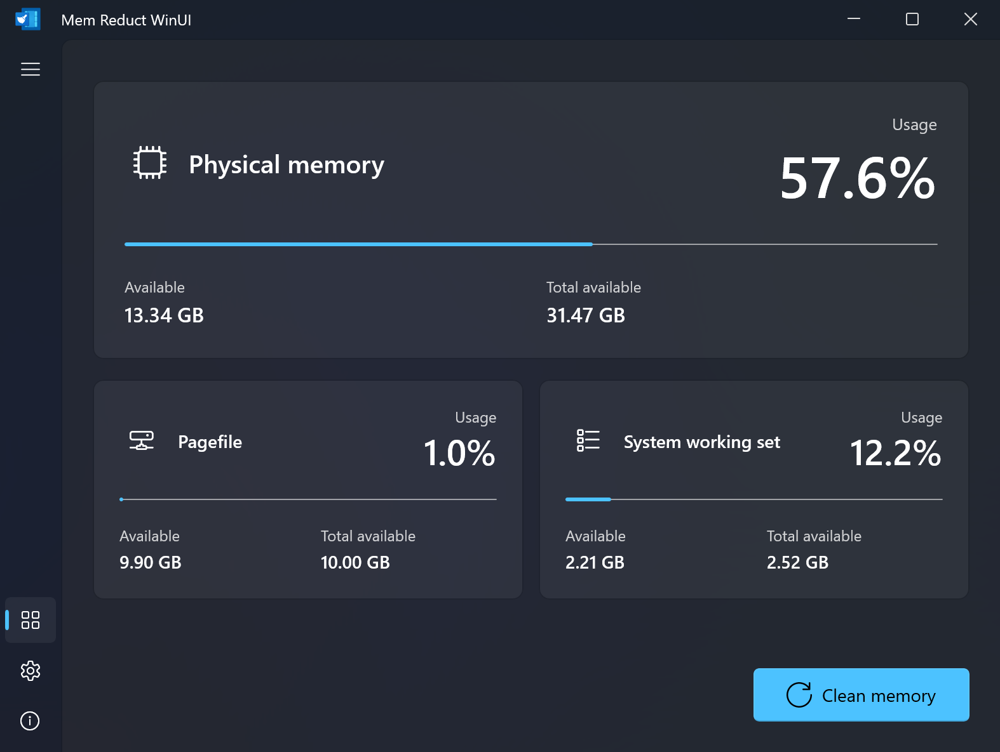

<p align="center">
  
</p>

<h1 align="center">Mem Reduct WinUI</h1>

<p align="center">
  <a href="README.md">简体中文</a> ·
  <strong>English</strong> ·
  <a href="CHANGELOG_EN.md">Changelog</a>
</p>

<p align="center">
  <a href="https://github.com/Pimnghi/memreduct-winui/releases/latest"></a>
  <a href="https://github.com/Pimnghi/memreduct-winui/releases"></a>
  <a href="https://github.com/Pimnghi/memreduct-winui/actions/workflows/build.yml"></a>
  
  
  <a href="LICENSE"></a>
</p>

Real-time memory management application with WinUI 3 native interface. Built on the original [Mem Reduct](https://github.com/henrypp/memreduct) core engine.

## Preview



## Download

The **Installer is recommended** for most users. Choose the Portable archive
when you need a no-install deployment. Most Intel/AMD PCs use x64; Windows on
Arm devices use ARM64.

| Architecture | Installer (recommended) | Portable |
| --- | --- | --- |
| x64 | [Download installer](https://github.com/Pimnghi/memreduct-winui/releases/download/v1.0.0/MemReductWinUI-1.0.0-win-x64-setup.exe) | [Download portable](https://github.com/Pimnghi/memreduct-winui/releases/download/v1.0.0/MemReductWinUI-1.0.0-win-x64.zip) |
| ARM64 | [Download installer](https://github.com/Pimnghi/memreduct-winui/releases/download/v1.0.0/MemReductWinUI-1.0.0-win-arm64-setup.exe) | [Download portable](https://github.com/Pimnghi/memreduct-winui/releases/download/v1.0.0/MemReductWinUI-1.0.0-win-arm64.zip) |

[All releases](https://github.com/Pimnghi/memreduct-winui/releases) ·
[SHA-256 checksums](https://github.com/Pimnghi/memreduct-winui/releases/download/v1.0.0/MemReductWinUI-1.0.0-SHA256SUMS.txt)

> [!IMPORTANT]
> Memory cleanup requires administrator privileges. The current binaries are
> not Authenticode-signed, so Windows UAC displays “Unknown publisher”. Only
> download release files from this repository.

## Features

- Real-time monitoring of physical memory, pagefile, and system working set
- One-click memory cleanup using Windows Native API
- System tray with right-click menu and balloon notifications
- Multi-language support (30+ languages)
- Auto-clean based on memory threshold or time interval
- Global hotkey support
- Dark/Light theme following Windows system settings
- Command-line mode (`-clean`, `-clean:full`)
- Single instance with tray minimization
- Startup with Windows (scheduled task, no UAC prompt)

## System Requirements

- Windows 10 version 17763 or later (64-bit or ARM64)
- Administrator privileges (auto-elevation on launch)

## Build

### Prerequisites

- Windows 10 version 1809 or later
- .NET 9.0 SDK
- Visual Studio 2022 Build Tools
- Inno Setup 7.0.2 or later (only required for installer packages)

The complete Visual Studio IDE is not required. The C# WinUI 3 application is
built by the .NET SDK, but `CoreLib.dll` and `mrw-cli.exe` are native C/C++
projects that use the v143 toolset. Rider and the .NET SDK alone therefore
cannot build the complete solution.

Install the standalone, IDE-free
[Visual Studio 2022 Build Tools](https://visualstudio.microsoft.com/visual-cpp-build-tools/)
with the **Desktop development with C++** workload, and make sure the following
components are selected:

- MSBuild
- MSVC v143 x64/x86 build tools
- MSVC v143 ARM64/ARM64EC build tools
- Windows 11 SDK 10.0.26100

The ARM64 tools can be an optional component. Without them, x64 can still
build, but the complete x64/ARM64 release process will fail. A full Visual
Studio 2022 installation is also supported, but is not required.

### Rider

Rider can be used as the primary IDE. Open
`Settings | Build, Execution, Deployment | Toolset and Build`, then:

- Point `.NET CLI executable path` to the installed .NET SDK.
- Select the MSBuild supplied by Visual Studio Build Tools as
  `MSBuild version`.
- If a full solution build skips native projects or custom MSBuild targets,
  disable `Use ReSharper Build` so Rider delegates the complete build to
  `MSBuild.exe`.

For release builds, run the PowerShell scripts below from Rider's integrated
terminal. This ensures that the same clean-build, architecture, and version
checks are always applied.

### Verify the Environment

```powershell
dotnet --version

& "${env:ProgramFiles(x86)}\Microsoft Visual Studio\Installer\vswhere.exe" `
    -latest -products * -requires Microsoft.Component.MSBuild `
    -property installationPath
```

The second command should print the installation directory of Visual Studio
Build Tools or a full Visual Studio installation. The build script uses the
same `vswhere` discovery mechanism, so no script changes are needed when only
Build Tools is installed.

### Build Steps

```powershell
# Run from the memreduct-winui directory

# Clean-build and publish both self-contained architectures
.\build-publish.ps1

# Build one architecture only
.\build-publish.ps1 -Platform x64
```

Outputs: `artifacts\publish\win-x64\` and
`artifacts\publish\win-arm64\`.

`build-publish.ps1` first uses MSBuild to compile `CoreLib.dll` and
`mrw-cli.exe` for each requested architecture, then uses `dotnet publish` for
the C# WinUI application. It verifies version consistency and checks that
`memreduct-winui.exe`, `CoreLib.dll`, and `mrw-cli.exe` all match the target
architecture. Do not replace the complete publish script with a standalone
`dotnet build`; that would not produce the validated native binaries and final
application directory.
The repository-local `src\app.h` is the canonical version source for the
WinUI application. No source file from a parent checkout of the original Mem
Reduct project is required, so a fresh clone builds independently.

To build the upload-ready versioned ZIP archives and checksums:

```powershell
.\build-portable.ps1
```

Portable release files are written to `artifacts\portable\`.

To build the self-contained per-machine installers for x64 and ARM64:

```powershell
.\build-installer.ps1
```

Inno Setup 7.0.2 or later is required. Installers and their checksum files are
written to `artifacts\installer\`. The application is installed under
`Program Files\Mem Reduct WinUI`; upgrades preserve settings, and uninstall
offers to remove settings and logs.

## Command Line

```powershell
mrw-cli.exe
mrw-cli.exe -clean
mrw-cli.exe -clean:full
```

Run `mrw-cli.exe` without arguments to display detailed help in the language
selected by the application. `-h`, `--help`, and `/?` display the same help
without requesting elevation.
`-clean` uses the saved cleanup mask and `-clean:full` selects every region.
Exit code `0` means full success, `1` means failure or partial failure, and `2`
means invalid arguments or elevation failure.
`mrw-cli.exe` waits in the current terminal while the elevated worker runs and
returns its localized result without opening another Command Prompt window.
The original command-line parameters on `memreduct-winui.exe` remain available
for compatibility.

## Project Structure

```
memreduct-winui/
├── .github/                   CI, Issue Forms, dependency updates
├── src/                       Native version and resource contracts
│   ├── app.h                  Canonical version source
│   └── resource.h             Stable resource IDs
├── App.xaml(.cs)              Application entry
├── MainWindow.xaml(.cs)       Main window, navigation, tray, hotkey
├── MainPage.xaml(.cs)         Memory statistics + clean
├── SettingsPage.xaml(.cs)     Settings
├── AboutPage.xaml(.cs)        About dialog
├── Core/                      C# bridge layer
│   ├── CoreService.cs         C DLL wrappers
│   ├── NativeMethods.cs       P/Invoke declarations
│   ├── IniConfig.cs           INI config via kernel32
│   ├── TrayIcon.cs            SysTray icon + context menu
│   ├── AutoCleanService.cs    Background auto-clean timer
│   ├── ToastService.cs        Balloon notification helper
│   └── StrId.cs               String resource ID constants
├── CoreLib/                   Native C DLL
│   ├── core.h / core.c        Memory cleanup core
│   ├── CoreLib.def            Exported functions
│   ├── CoreLib.vcxproj        MSBuild project
│   └── routine/               Shared C library
├── CliHost/                   Native console entry point (mrw-cli.exe)
├── language/
│   └── memreduct-winui.lng    Language translations
├── Assets/                    App icons and images
├── global.json                .NET 9 SDK feature band
├── app.manifest               Win32 app manifest
└── memreduct-winui.csproj     Project file
```

## Configuration

The portable build stores settings in `data\memreduct-winui.ini` alongside the
executable. The installed build stores settings in
`%ProgramData%\Mem Reduct WinUI\data\memreduct-winui.ini`. When cleanup
logging is enabled, results are written to the corresponding `data` directory.

## License

This project is a refactoring based on Henry++'s
[Mem Reduct](https://github.com/henrypp/memreduct) and is distributed under the
[GNU General Public License v3.0](LICENSE).
